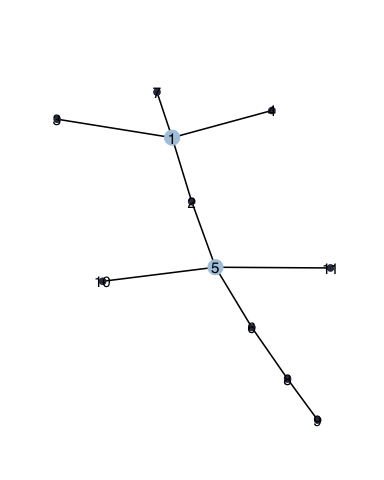

<!-- README.md is generated from README.Rmd. Please edit that file -->
nestor
======

<!-- badges: start -->
[](https://travis-ci.org/Rmomal/nestor) <!-- [](https://codecov.io/gh/Rmomal/nestor?branch=master) --> <!-- badges: end -->

Network inference from Species counTs with missing actORs.

> `nestor` is an R package which aim is to infer network of species conditional dependencies from their abundances, while accounting for possible missing actors in the data.

Installation
------------

You can install the development version from [GitHub](https://github.com/) with:

``` r
install.packages("devtools")
devtools::install_github("Rmomal/nestor")
```

Example
-------

`nestor`simulates data with the function `missing_from_scratch()`, which requires the desired type of dependency structure (scale-free, erdos or cluster) and the number of missing actors `r`. Here is an example with `r=1`for the scale-free structure:

``` r
library(nestor)
#> 
#> Attaching package: 'nestor'
#> The following object is masked from 'package:EMtree':
#> 
#>     Kirshner
set.seed(1)
data=missing_from_scratch(n=100,p=10,r=1,type="scale-free", plot=TRUE)
```



The original clique of the missing actor neighbors is available in the value `TC`:

``` r
data$TC
#> [[1]]
#> [1] 1 2 3 6
```

The data is then prepared for analysis with the first step of the procedure: fit the PLN model. The `norm_PLN()`function is a wraper to `PLNmodels::PLN()` which normalizes all the necessary outputs, namely the means, variance and correlation matrices of the model latent Gaussian layer corresponding to observed species.

``` r
PLNfit<-norm_PLN(data$Y)
#> 
#>  Initialization...
#>  Adjusting a PLN model with full covariance model
#>  Post-treatments...
#>  DONE!
MO<-PLNfit$MO
SO<-PLNfit$SO
sigma_obs=PLNfit$sigma_obs
```

`nestor` then needs to be initialized. This requires to find an initial clique of neighbors for the missing actor:

``` r
initClique= FitSparsePCA(data$Y,r=1)$cliques
```

or a list of several possible cliques, for example using `complement_spca()`. The `nestor` package also provides with a bootstraped version of sPCA `boot_FitSparsePCA()`, and the function `init_blockmodels()` which uses package `blockmodels`.

``` r
six_cliques= complement_spca(data$Y, k=3) 
six_cliques
#> [[1]]
#> [[1]][[1]]
#> [1] 3 6 8
#> 
#> 
#> [[2]]
#> [[2]][[1]]
#> [1] 2 9
#> 
#> 
#> [[3]]
#> [[3]][[1]]
#> [1]  9 10
#> 
#> 
#> [[4]]
#> [[4]][[1]]
#> [1]  1  2  4  5  7  9 10
#> 
#> 
#> [[5]]
#> [[5]][[1]]
#> [1]  1  3  4  5  6  7  8 10
#> 
#> 
#> [[6]]
#> [[6]][[1]]
#> [1] 1 2 3 4 5 6 7 8
```

Once an initial clique has been found, the algorithm can be initialized.This is the aim of the function `initVEM()`, which initializes all required parameters. This function builds one initialization from one initial clique. In this example we run the oracle procedure: the initialization is done with the true clique.

``` r
initList=initVEM(data$Y,cliqueList=data$TC,cov2cor(sigma_obs), MO,r=1 )
str(initList)
#> List of 4
#>  $ Wginit   : num [1:11, 1:11] 0 0.00826 0.00826 0.00826 0.00826 ...
#>  $ Winit    : num [1:11, 1:11] 0 0.00826 0.00826 0.00826 0.00826 ...
#>  $ omegainit: num [1:11, 1:11] 3.4633 1.2964 1.9354 0.7364 -0.0652 ...
#>   ..- attr(*, "dimnames")=List of 2
#>   .. ..$ : chr [1:11] "Y1" "Y2" "Y3" "Y4" ...
#>   .. ..$ : chr [1:11] "Y1" "Y2" "Y3" "Y4" ...
#>  $ MHinit   : num [1:100, 1] 0.368 0.248 -0.404 -0.802 -1.893 ...
```

The core function `nestor()` can now be run as follows:

``` r
fit=nestor(data$Y, MO,SO, initList=initList,alpha=0.1,eps=1e-3, 
           maxIter=30,verbatim = FALSE, trackJ=FALSE)
```

This package contains several visualization functions. `plotPerf()` gives a quick overview of the fit performance compared to initial graph:

``` r
plotPerf(fit$Pg, data$G,r=1)
```


The convergence of `nestor()` can be checked with the plotting function `plotConv()`:

``` r
plotConv(nestorFit = fit)
```


This package provides with a parllel procedure for the computation of several fits of `nestor()` corresponding to a list of possible cliques, with the function `List.nestor()`. Below is an example with the list of four cliques previously obtained with the `complement_spca()` function:

``` r
fitList=List.nestor(six_cliques, data$Y,cov2cor(sigma_obs), MO,SO,r=1,eps=1e-3,
                    maxIter = 50, alpha=0.1)
do.call(rbind,lapply(fitList, length))
#>      [,1]
#> [1,]    3
#> [2,]    3
#> [3,]   12
#> [4,]   12
#> [5,]    3
#> [6,]   12
```

The object `fitList` is simply the list of all the `nestor()` fits. This procedure aborts in case of degenerated behaviour, which happens when the provided clique is too far from truth. Wrong fits can be spotted by their ouput size, as above. We can know see the behaviour of the lowerbound final values with the AUC of each converged fit:

``` r
do.call(rbind,lapply(fitList, function(vem){
  if(length(vem)>4){
    c(auc=auc(vem$Pg, data$G), J=tail(vem$lowbound$J,1))
  }
})) %>% as_tibble()  
#> # A tibble: 3 x 2
#>     auc     J
#>   <dbl> <dbl>
#> 1  0.69 -587.
#> 2  0.67 -500.
#> 3  0.77 -498.
```
